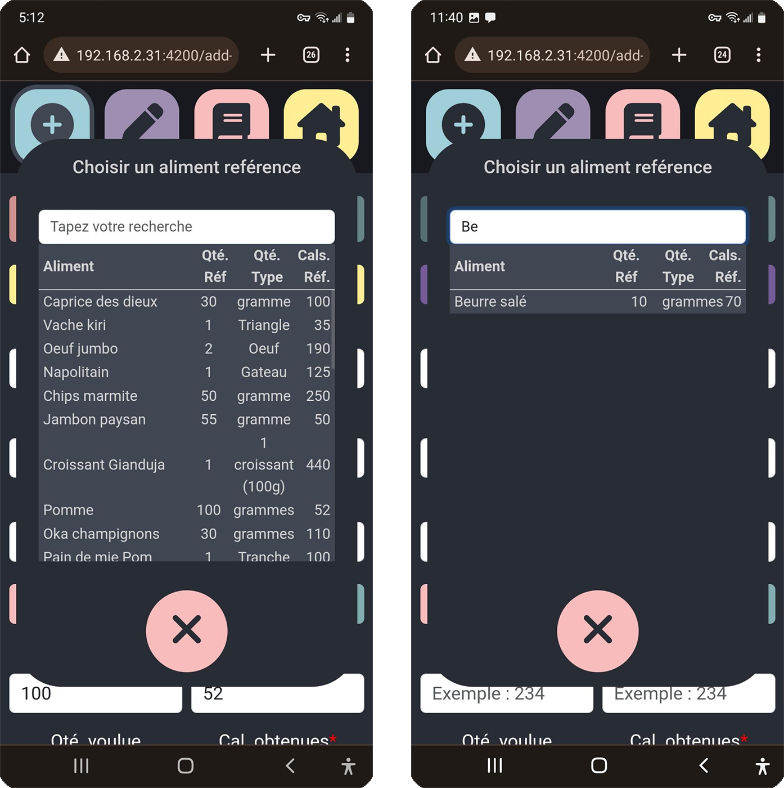
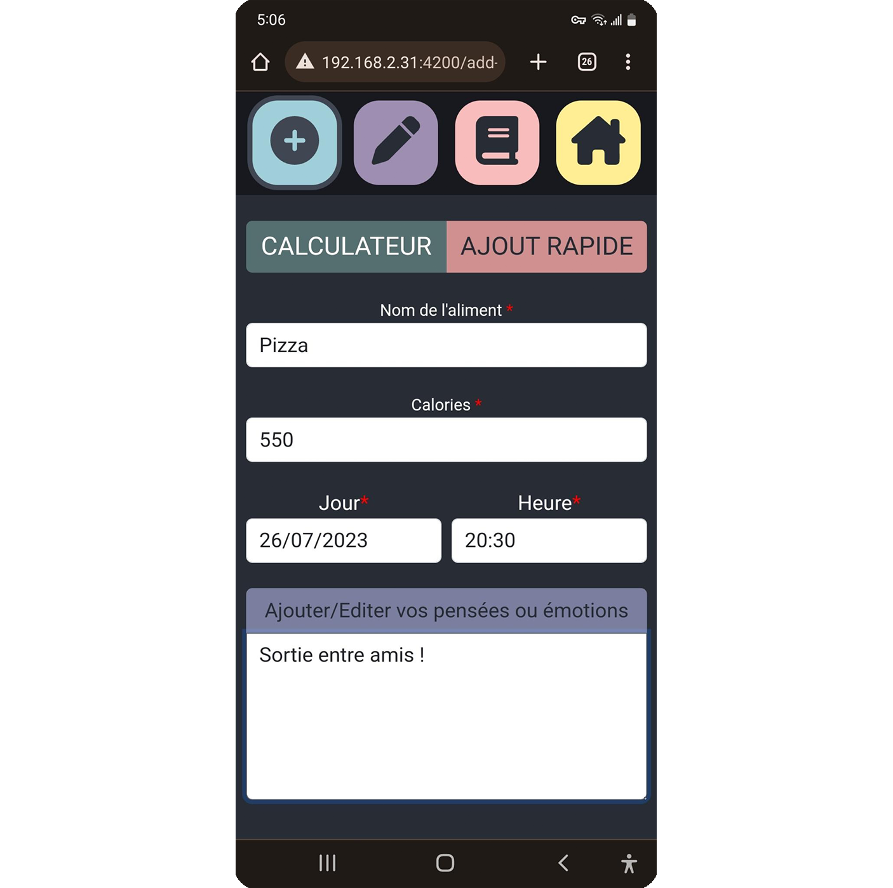

# Features:
[Version française içi](manuel.md)

## Reference Food Database
A reference food database allows users to add, edit, and delete commonly used foods.

The necessary information for calculating calories is stored for each food item:
- Food name
- Reference quantity
- Type of quantity (grams, ml, piece, cup, etc.)
- Number of calories associated with the reference quantity

- Users can easily search for these reference foods when adding to their food journal, and the calculator will be automatically pre-filled.

To edit a reference food item, go to the editing tab of the application.

## Food Journal

### Adding Foods
The food journal allows the user to record the foods they consume throughout the day.

#### Quick Add:
The quick add mode allows users to add a food item without using the reference foods or the calculator. In this mode, the user only needs to enter:
- Food name
- Number of calories consumed
- Time and date of the meal
- Thoughts associated with this food

#### Adding with Calorie/Quantity Calculator
After entering:
- Food name
- Time and date of the meal
- Thoughts associated with this food

The `calculator` mode allows the user to select a consumed reference food, and either:
- Calculate **the number of calories** based on the quantity consumed
- Calculate **the quantity to eat** in order to consume the desired number of calories.

### The Journal
The food journal displays the total number of calories consumed throughout the day, the daily goal, and the remaining number of calories.

The list of foods consumed during the day is displayed by meal, along with a total calorie count for each meal. Meals are divided into time slots:
- Morning: 00:00 to 11:30 AM (excluded)
- Midday: 11:30 AM to 2:30 PM (excluded)
- Afternoon: 2:30 PM to 5:45 PM (excluded)
- Evening: 5:45 PM to 12:00 AM (excluded)

Clicking on an entry displays more details, such as associated thoughts, and provides the option to **delete** the entry.

