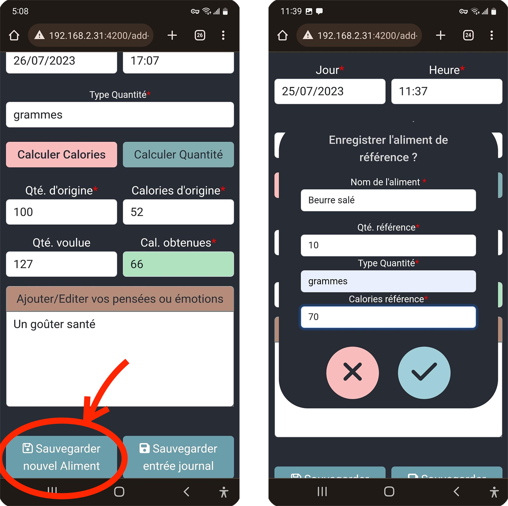
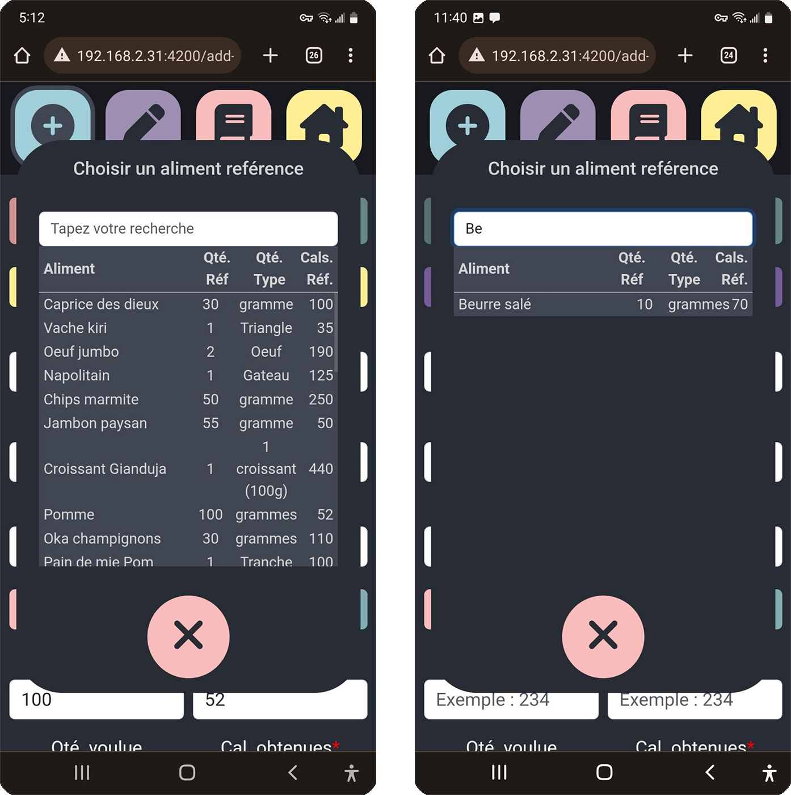
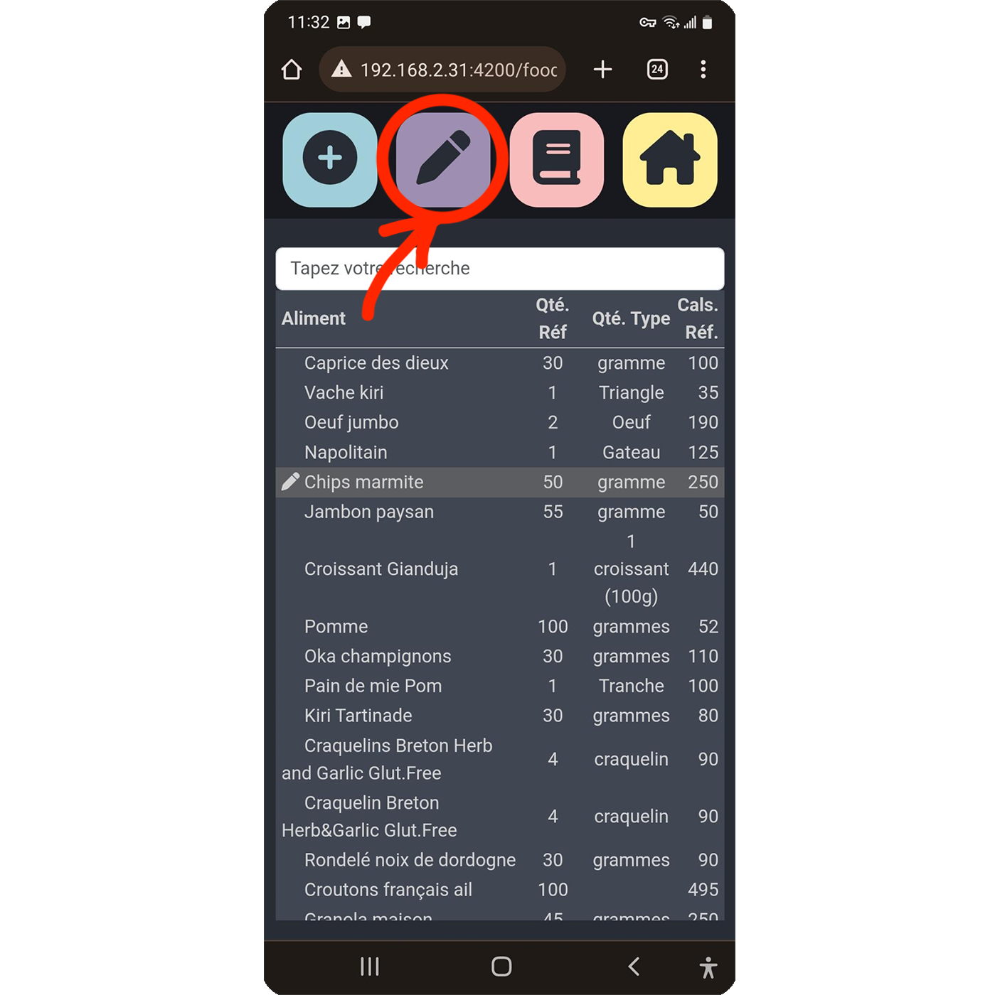
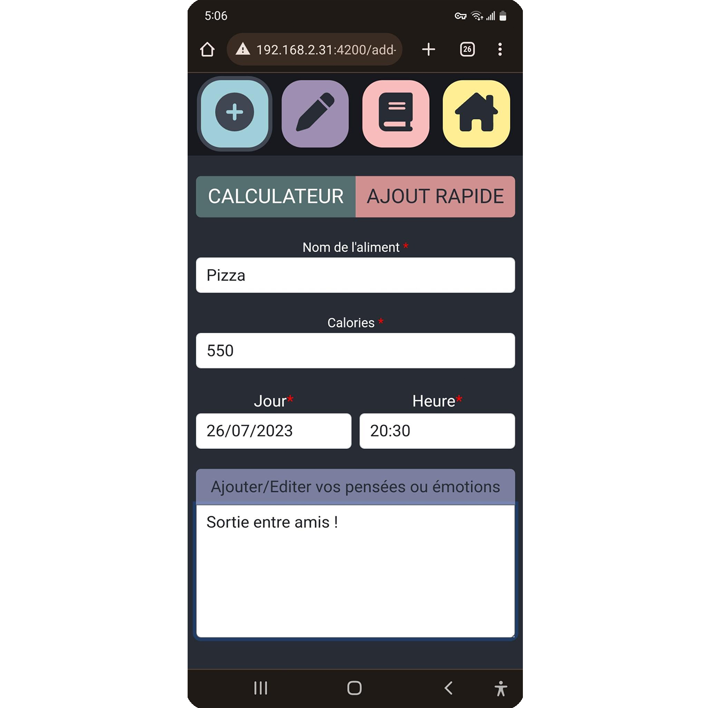
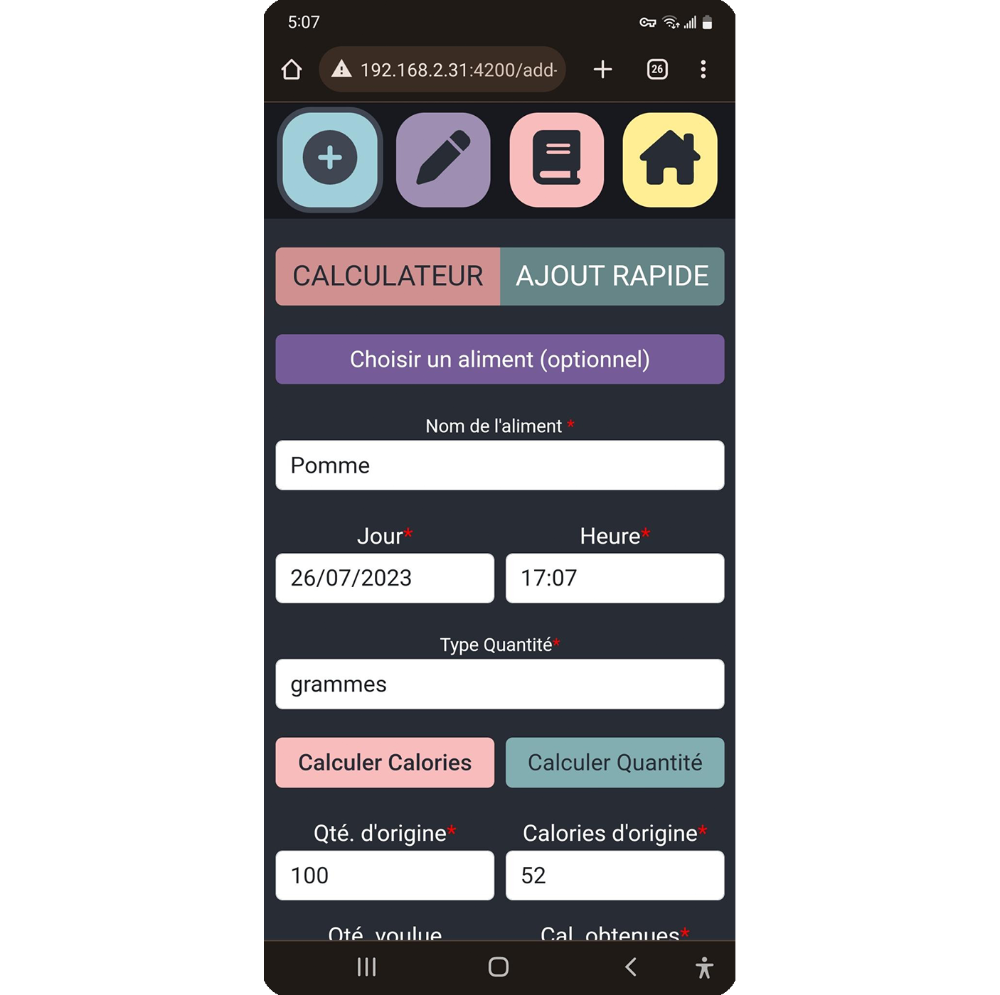
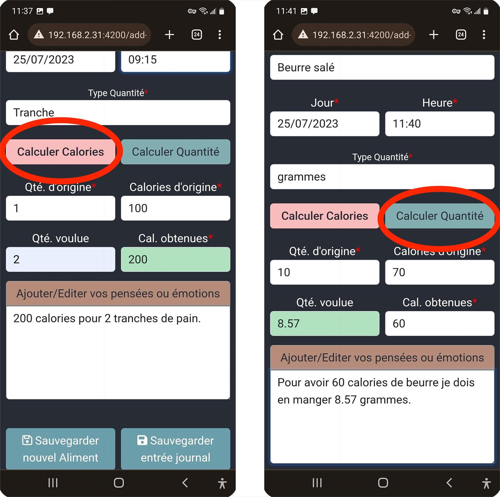
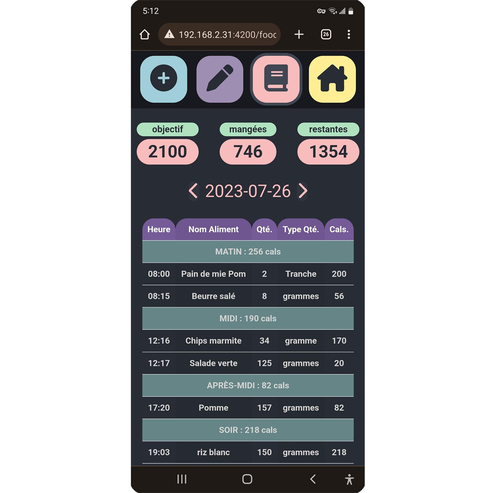

# Fonctionnalités :
[English version here](manual.md)

## Base de donnée d'aliments de référence
Une base de donnée d'aliments de références permet aux utilisateurs d'ajouter, d'éditer et de supprimer
des aliments fréquemments utilisés. 

Les informations de l'aliment nécessaire au calcul des calories sont stockées :
- le nom de l'aliment
- une quantité de référence
- le type de cette quantité (grammes, ml, morceau, tasse...)
- le nombre de calories associé à la quantité de référence

- L'utilisateur peut ensuite facilement rechercher ces aliments lors d'un ajout au journal alimentaire et 
pourra ainsi utiliser le calculateur qui sera automatiquement pré-rempli.

Pour éditer un aliment de référence, se rendre dans l'onglet édition de l'application

## Journal alimentaire

### Ajouter des aliments
Le journal alimentaire permet à l'utilisateur d'enregistrer les aliments qu'il consomme tout au long de la journée.

#### Ajout rapide :
Le mode d'ajout rapide permet d'ajouter un aliment sans utiliser les aliments de référence ni le calculateur. 
Ainsi l'utilisateur n'a qu'à entrer :
- le nom de l'aliment
- le nombre de calories ingérées
- l'heure et la date du repas
- les pensées associées à cette consommation

#### Ajout avec calculateur de calories/quantité
Après avoir entré :
- le nom de l'aliment
- l'heure et la date du repas
- les pensées associées à cette consommation

Le mode `calculateur` permet de sélectionner un aliment de référence consommé puis :
- soit de calculer **le nombre de calories** en fonction de la quantité consommée
- soit de calculer **la quantité à consommer** en fonction du nombre de calories que l'utilisateur voudrait consommer.

### Consulter le journal
La consultation du journal permet de voir le nombre total de calories mangées dans la journée, l'objectif journalier
ainsi que le nombre restant.
La liste des aliments consommés dans la journée est affichée par repas ainsi qu'un total de calories par repas consommé
La division des repas se fait par crénneau horaire :
- Matin : 00h à 11:30(exclu)
- Midi : 11h30 à 14h30(exclu)
- Après-midi : 14h30 à 17h45(exclu)
- Soir : 17h45 à 00h(exclu)

Un clic sur une entrée permet l'affichage de plus de détails comme les pensées associées, et 
offre la possibilité de **supprimer** l'entrée.

